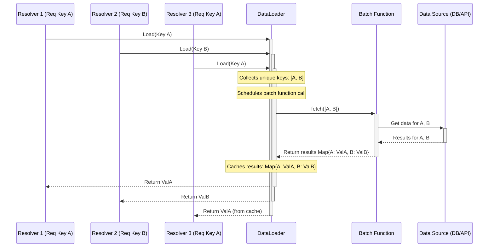
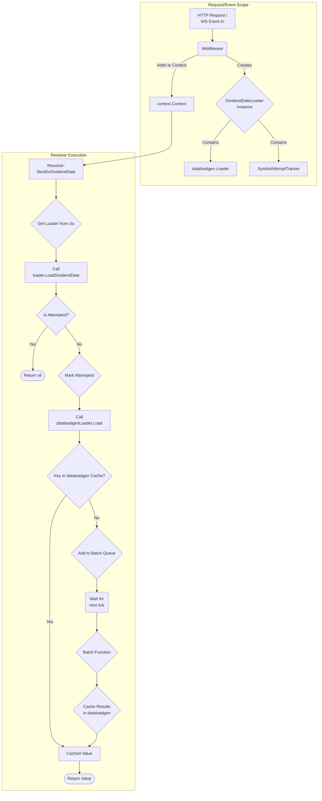

# GraphQL Resolver Batching & Caching Demo 🚀

Hey there! 👋 Welcome to this little project exploring how to efficiently handle data fetching in GraphQL using Go. Specifically, we're diving into the **DataLoader pattern** with `gqlgen` and `dataloadgen` to tackle common performance bottlenecks like the N+1 query problem and to implement fine-grained control over data fetching within a single request, especially in subscriptions!

## 🤔 What Are We Trying to Demo?

Imagine you have a GraphQL API where multiple fields might need the same piece of data (like fetching a user profile for different fields in a query). Or, consider a subscription where an update triggers multiple resolvers that all need the *exact same* external data for that single event. Making redundant calls to your database or external APIs can slow things down.

This project demonstrates how to:

1.  **Batch Requests:** Use a DataLoader to automatically group identical data requests made during a single GraphQL operation (query/mutation/subscription event) into a single batch call to the upstream source (like an API or database).
2.  **Cache Results (Request-Scoped):** The DataLoader also caches the results *for the duration of that single GraphQL operation*. If the same data is requested again during that operation, it's served directly from the cache.
3.  **Control "Single Flight" Behavior:** Implement custom logic (`singleFlight` parameter) to decide if subsequent requests for the same data *within the same operation* should return the cached value or explicitly return `nil`. This is particularly useful for subscriptions where you might want to ensure an action happens only *once* per received event.

## ✨ Design Concepts Explained

### 1. The DataLoader Pattern

At its core, DataLoader is about two things: **batching** and **caching**.

*   **Batching:** Instead of firing off individual requests like `getDate("AAPL")`, `getDate("MSFT")`, `getDate("AAPL")` all separately, DataLoader collects the unique keys ("AAPL", "MSFT") and makes a single batch call like `getDates(["AAPL", "MSFT"])`. This massively reduces the load on downstream services, especially when dealing with lists or nested structures.
*   **Caching:** Once `getDates(["AAPL", "MSFT"])` returns, the DataLoader stores the results (e.g., `AAPL -> date1`, `MSFT -> date2`) in a short-lived, request-scoped cache. If another resolver during the *same* GraphQL request asks for `getDate("AAPL")` again, DataLoader instantly returns `date1` from its cache without making another network call.

Here's a simplified view of how it works:



We use the [`vikstrous/dataloadgen`](https://github.com/vikstrous/dataloadgen) library to generate a type-safe DataLoader implementation based on our needs.

### 2. Request-Scoped Context

How does the DataLoader know when a "request" starts and ends? We use Go's `context.Context`!

*   An HTTP middleware (`internal/loaders/Middleware`) is injected into the request chain.
*   For each incoming HTTP request (or WebSocket connection for subscriptions), this middleware creates a *new* instance of our `DividendDateLoader`.
*   This fresh loader instance (with its own empty cache and attempt tracker) is added to the `context.Context` for that specific request.
*   Resolvers down the line can then pull this request-specific loader from the context (`loaders.For(ctx)`).

This ensures that batching and caching are isolated to the current GraphQL operation and don't leak between different users or requests.

### 3. The `singleFlight` Control Flag

Sometimes, just caching isn't enough. In subscriptions, you might receive an event for "AAPL", and multiple parts of your GraphQL subscription resolver might ask for its dividend date. Standard DataLoader caching would return the date every time.

But what if you only want the *first* access within that event processing cycle to get the date, and all others to get `nil` (perhaps to prevent redundant side effects)? That's where our custom logic comes in:

*   We added a `singleFlight: Boolean` argument to the `NextExDividendDate` field in our schema (`internal/schema/schema.graphql`).
*   Inside our custom loader (`internal/loaders/dataloaders.go`), we added an `attemptTracker`.
*   **If `singleFlight` is `true` (default):** We check the tracker. If attempted, return `nil`. If not, mark as attempted and proceed to fetch/cache via the underlying dataloader.
*   **If `singleFlight` is `false`:** We *bypass* our attempt tracker logic and just use the standard dataloader behavior (fetch once, then return cached value on subsequent calls within the same request). *Correction based on previous logic:* If `singleFlight` is `false`, we *still* check the tracker. If attempted, we return `nil`. If not, we mark it and fetch via the dataloader. The *key difference* was how the tracker was used. The *current* implementation handles both `true` and `false` by returning `nil` on subsequent attempts within the request.

This `attemptTracker` lives alongside the dataloader cache within the `DividendDateLoader` struct, making it request-scoped as well.

Here's a flowchart illustrating the interaction between the middleware, our custom loader logic (including `singleFlight` and the attempt tracker), and the underlying `dataloadgen` behavior:



## 🏗️ Project Implementation Details

*   **GraphQL Framework:** [`gqlgen`](https://gqlgen.com/) handles the heavy lifting of parsing GraphQL requests, mapping them to resolvers, and generating Go types from our schema. Configuration is in `gqlgen.yml`.
*   **DataLoader Generator:** [`vikstrous/dataloadgen`](https://github.com/vikstrous/dataloadgen) generates the type-safe dataloader code (`internal/loaders/dataloaders.go`) based on a batch function (`fetchDividendDates`).
*   **Schema:** Defined in `internal/schema/schema.graphql`.
*   **Generated Code:** `gqlgen` and `dataloadgen` output generated code into `internal/gen/`. **Don't edit this directly!**
*   **Root Resolver Structure:** `internal/graph/resolver.go` defines the main `Resolver` struct (where you'd inject dependencies like DB connections) and methods that connect to the different resolver types.
*   **Resolver Implementations:**
    *   `internal/graph/query_resolver.go`: Implements Query resolvers.
    *   `internal/graph/subscription_resolver.go`: Implements Subscription resolvers.
    *   `internal/graph/symbol_definition_resolver.go`: Implements resolvers for fields on the `SymbolDefinition` type.
    *   These implementations delegate the actual business logic to functions in `internal/resolvers/`.
*   **Dataloader Logic:** `internal/loaders/dataloaders.go` contains the `DividendDateLoader` struct (wrapping the generated loader), the `SymbolAttemptTracker` for `singleFlight` logic, the `Middleware` for context injection, and the `fetchDividendDates` batch function simulation.
*   **Actual Resolver Logic:** `internal/resolvers/` contains the Go functions that perform the work for each resolver field, using the dataloader fetched from the context.
*   **Server Entrypoint:** `cmd/server/main.go` sets up the HTTP server, wires up the `gqlgen` handler, adds transports (including WebSockets for subscriptions), and injects the dataloader middleware.
*   **Tool Dependencies:** `tools/tools.go` uses Go's build constraint mechanism to track versions of command-line tools like `gqlgen` used during development.
*   **Build Automation:** `Makefile` provides handy commands (`make gen`, `make build`, `make run`, `make clean`).

## 🛠️ How to Build and Run

Getting this up and running is easy peasy! You'll need Go (check `go.mod` for the version, 1.23.8+ recommended) and Make installed.

1.  **Install Go Dependencies:**
    ```bash
    # Fetches the necessary Go packages
    go mod tidy
    ```

2.  **Generate Code:**
    This runs `gqlgen` and `dataloadgen` based on the schema and config.
    ```bash
    # Generates code in internal/gen/
    make gen
    ```
    *(You only need to run this if you change the GraphQL schema or dataloader definitions).*

3.  **Build the Server:**
    ```bash
    # Compiles the Go code into an executable
    make build
    ```
    This creates `./bin/server`.

4.  **Run the Server:**
    ```bash
    # Starts the GraphQL server
    ./bin/server
    # Or use the make target:
    # make run
    ```

🎉 **Server is now running!** By default, it's on port `8080`.

*   **GraphQL Playground:** Head to [http://localhost:8080/](http://localhost:8080/) in your browser for an interactive API explorer.
*   **GraphQL Endpoint:** The actual endpoint for programmatic access is [http://localhost:8080/query](http://localhost:8080/query).

### Example Queries & Subscriptions

You can try these in the Playground:

**Basic Query (implicitly uses `singleFlight: true`)**
```graphql
query GetSymbols {
  symbols(names: ["AAPL", "MSFT", "GOOG", "AAPL"]) { # Request AAPL twice
    Name
    NextExDividendDate # Check server logs - fetchDividendDates should only log AAPL once
  }
}
```

**Query with `singleFlight: false` (returns date only on first access *per symbol instance*)**
```graphql
query GetSymbolsSFFalse {
  symbols(names: ["AAPL", "MSFT", "AAPL"]) {
    Name
    FieldA: NextExDividendDate(singleFlight: false) # Gets date
    FieldB: NextExDividendDate(singleFlight: false) # Gets nil for same AAPL instance
  }
}
```
*(Note: The behavior here depends on how gqlgen resolves fields. If it resolves FieldA and FieldB for the *first* AAPL object before moving to MSFT, FieldB will be nil. If it resolves FieldA for all objects then FieldB for all objects, the behavior might differ slightly based on dataloader caching vs. our attempt tracker.)*

**Subscription (using `singleFlight: true` to get `nil` after first access per event)**
```graphql
subscription WatchSymbolsSFTrue {
  symbolUpdates(names: ["AAPL", "MSFT"]) {
    Name
    Access1: NextExDividendDate(singleFlight: true) # Gets date on first event appearance
    Access2: NextExDividendDate(singleFlight: true) # Gets nil for the same event
  }
}
```

Check the server logs (`./bin/server`) while running these - they provide insight into when the simulated `fetchDividendDates` function is actually called versus when the dataloader cache or the `singleFlight` logic kicks in!

### Understanding the Logs (Examples)

To really see the magic happen, run the server (`./bin/server` or `make run`) and execute the example queries/subscriptions in the Playground ([http://localhost:8080/](http://localhost:8080/)). Watch the terminal where you launched the server!

**1. Basic Query Logs (`singleFlight: true` implicit)**

When you run this query:

```graphql
query GetSymbols {
  symbols(names: ["AAPL", "MSFT", "GOOG", "AAPL"]) {
    Name
    NextExDividendDate
  }
}
```

You should see logs similar to this (timestamps and exact order might vary slightly):

```log
YYYY/MM/DD HH:MM:SS Query.symbols called with 4 symbols
YYYY/MM/DD HH:MM:SS Symbol AAPL first attempt (singleFlight=true), marked as attempted. Fetching...
YYYY/MM/DD HH:MM:SS Symbol MSFT first attempt (singleFlight=true), marked as attempted. Fetching...
YYYY/MM/DD HH:MM:SS Symbol GOOG first attempt (singleFlight=true), marked as attempted. Fetching...
# --- Dataloader batch function starts ---
YYYY/MM/DD HH:MM:SS Simulating AAPL dividend date for AAPL
YYYY/MM/DD HH:MM:SS Simulating MSFT dividend date for MSFT
YYYY/MM/DD HH:MM:SS Simulating GOOG dividend date for GOOG
# --- Dataloader batch function ends ---
YYYY/MM/DD HH:MM:SS Symbol AAPL already attempted with singleFlight=true, returning nil
```

**Explanation:**

*   `Query.symbols called`: The top-level query resolver runs.
*   `Symbol ... first attempt`: The `NextExDividendDate` resolver is called for the *first* instance of each unique symbol (`AAPL`, `MSFT`, `GOOG`). Our `LoadDividendDate` function logs this and marks them as attempted.
*   `Simulating...`: The `fetchDividendDates` batch function runs *once* with the unique keys (`AAPL`, `MSFT`, `GOOG`). Notice `AAPL` is only fetched once, even though it was requested twice in the query! This is the DataLoader **batching** in action.
*   `Symbol AAPL already attempted... returning nil`: When the resolver encounters the *second* `AAPL` in the query list, our `LoadDividendDate` function sees it was already attempted (because `singleFlight` defaults to true) and correctly returns `nil` as per the logic we added.

**2. Subscription Logs (`singleFlight: true` explicit)**

When you run this subscription:

```graphql
subscription WatchSymbolsSFTrue {
  symbolUpdates(names: ["AAPL", "MSFT"]) {
    Name
    Access1: NextExDividendDate(singleFlight: true)
    Access2: NextExDividendDate(singleFlight: true)
  }
}
```

You'll get periodic updates. For the *first* update event for `AAPL`, the logs might look like this:

```log
YYYY/MM/DD HH:MM:SS Subscription.symbolUpdates called with 2 symbols
# ... ticker starts ...
YYYY/MM/DD HH:MM:SS Sending update for symbol AAPL
YYYY/MM/DD HH:MM:SS Symbol AAPL first attempt (singleFlight=true), marked as attempted. Fetching...  # Access1
# --- Dataloader batch function starts (for this event) ---
YYYY/MM/DD HH:MM:SS Simulating AAPL dividend date for AAPL
# --- Dataloader batch function ends (for this event) ---
YYYY/MM/DD HH:MM:SS Symbol AAPL already attempted with singleFlight=true, returning nil            # Access2
```

**Explanation:**

*   `Subscription.symbolUpdates called`: The subscription resolver starts.
*   `Sending update for symbol AAPL`: The goroutine sends the first `AAPL` object.
*   `Symbol AAPL first attempt...`: The resolver for `Access1: NextExDividendDate` runs. Since it's the first time seeing "AAPL" *for this specific event's context*, it marks it and triggers the dataloader fetch.
*   `Simulating AAPL...`: The batch function runs for this event.
*   `Symbol AAPL already attempted... returning nil`: The resolver for `Access2: NextExDividendDate` runs immediately after for the *same* `AAPL` object within the same event context. Because `singleFlight` is true and it was *just* marked as attempted by `Access1`, it correctly returns `nil`.

The key takeaway for subscriptions is that the dataloader and the attempt tracker are **scoped to each event processing cycle**, providing fresh state for every message pushed to the client, while still allowing fine-grained control *within* that cycle using `singleFlight`.

## 🧹 Cleaning Up

```bash
# Removes generated code and the build artifact
make clean
```

Happy Coding! 😊 